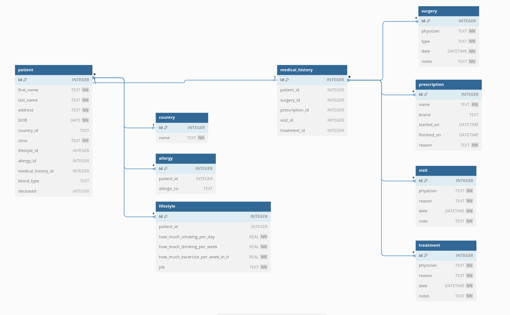

# Final Project

The final project for the cs50 introduction to databases with SQL was an opportunity to take my newfound skill with SQL and develop my very own database. 

## Specification
It is composed of three files:

1. **DESIGN.md**: 
    - A rigorous design document describing the database’s purpose, scope, entities, relationships, optimizations, and limitations. 
    - It includes:
        - An entity relationship diagram.
        - A video overview.
2. **schema.sql**: 
    - An annotated set of CREATE TABLE, CREATE INDEX, CREATE VIEW, etc. statements that compose the database’s schema.
3. **queries.sql**: 
    - An annotated set of SELECT, INSERT, UPDATE, DELETE, etc. statements that users will commonly run on the database.

### DESIGN.md
The DESIGN.md file, contains the database’s purpose, scope, entities, relationships, optimizations, and limitations. 

#### Entity Relationship Diagram
The DESIGN.md file includes an entity relationship diagram for the database. 

  

### schema.sql
The schema.sql file includes a set of SQL statements to define the database’s schema, annotated with brief SQL comments.

- It will contain CREATE TABLE, CREATE INDEX, and CREATE VIEW statements.

### queries.sql
The queries.sql file includes a set of SQL queries typically run on the database, annotated with brief SQL comments.

- It will contains SELECT, INSERT, UPDATE, and DELETE statements.

This was CS50 SQL!
